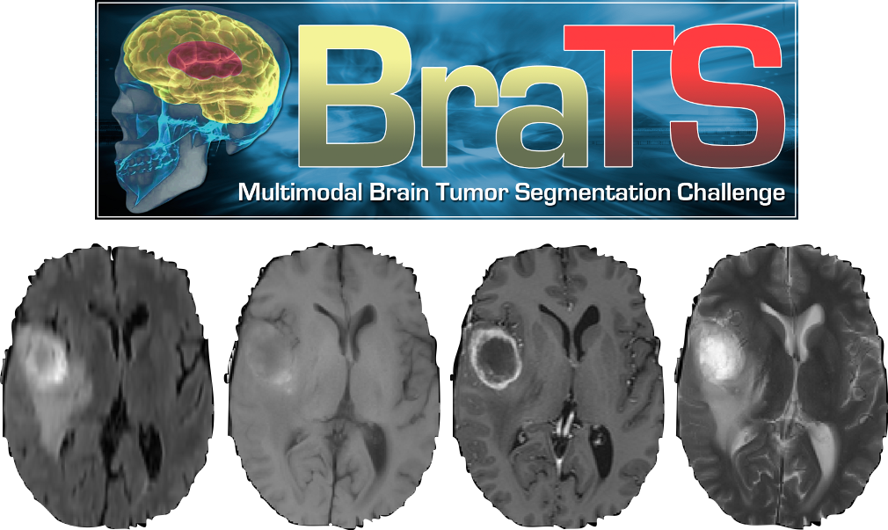
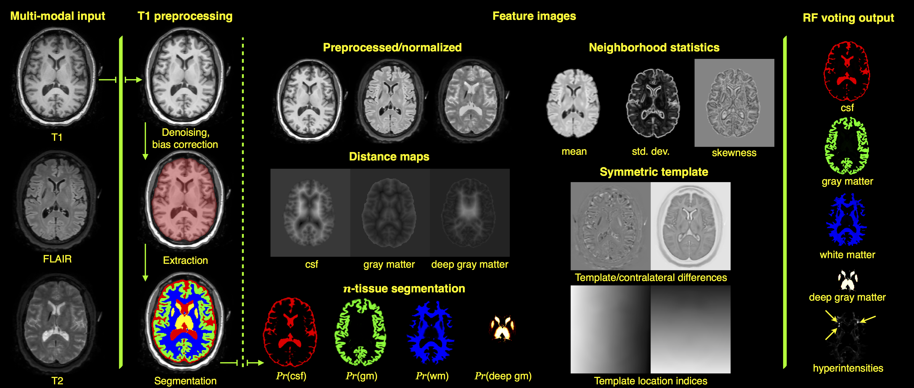
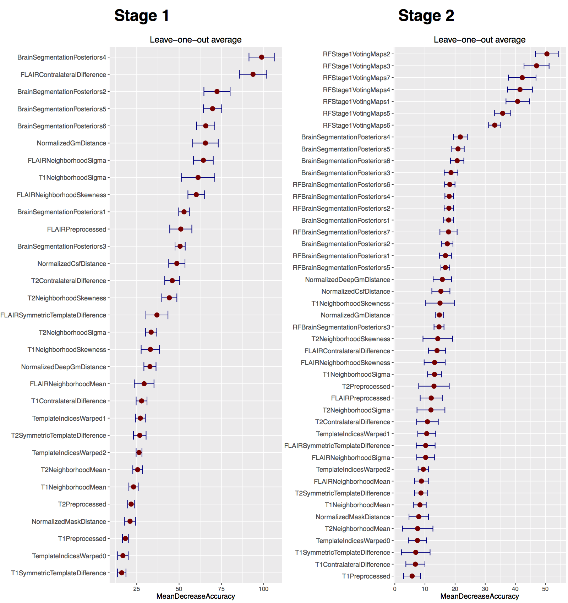
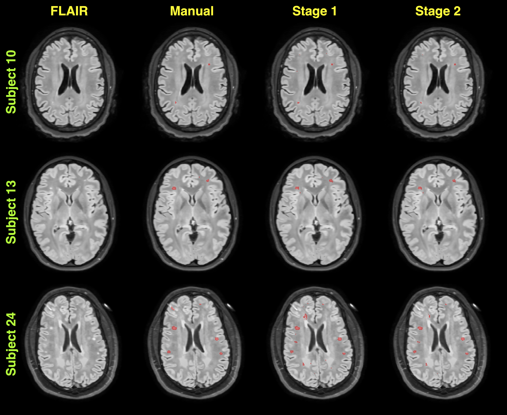

##  ANTs beginnings:  image registration

  

##  ANTs tools

* MRI bias correction
* image denoising
* image and point set registration
* $n$-tissue segmentation
* template building
* multi-atlas label fusion
* brain extraction
* cortical thickness estimation
* ANTsR for statistics and visualization

publicly available:  https://github.com/stnava/ANTs

## Competitions

## Competition:  BRATS 2013

*_only team out of 20 to make code publicly available._

## WMH segmentation

## Feature images

$label \sim_{RF} feature_{1} + \ldots + feature_{n}$

  

## Feature importance

## Sample results

