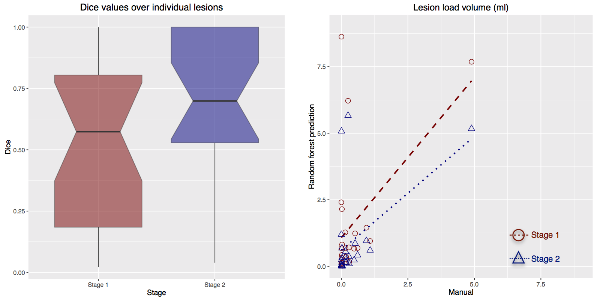

<!--

* Evaluation
    * Proper context
        * We only have manual labelings from a single radiologist (
        * TBI white matter hyperintensities are more difficult to segment than MS lesions
            * individual lesions are smaller
            * lesion load is typically smaller
            * not prone to enhancement
            * less distinct from surrounding tissue ?
    * Despite the doubts regarding the efficacy of a typical segmentation validation,
      our contribution is useful because
         * the total segmentation framework is publicly available within the ANTs/ANTsR
           framework
         * although only a single site is analyzed, the feature images are site-agnostic
              * we plan to apply the current RF models directly to the other site data
              * we can then build the training database further by enlisting other experts
         * Is this the first work exploring segmentation of white matter hyperintensities in TBI?
         * The data (including manual tracings) will be made available as part of the FITBIR
           effort.

-->

# Results

After performing the leave-one-out evaluation described at the end of the previous section,
we calculated the \texttt{MeanDecreaseAccuracy} feature values for each of the 24 subjects $\times$
2 models per subject $=48$ total models.  This measure (per feature, per model) is calculated
during the out-of-bag phase of the random forest model construction and quantifies the decrease
in prediction accuracy from omitting the specified feature.  In other words, this quantity
helps determine the importance of a particular feature and, although we save such
efforts for future work, this information provides us with guidance for future feature
pruning and/or additions.

The resulting rankings for both Stages are given in Figure 2 where the values for the
separate stages are averaged over the entire corresponding model set.  In addition, we
track the variance for each feature over all models to illustrate the stability of
the chosen features during the evaluation.  This latter information is illustrated as
horizontal errors bars providing the $95^{th}$ percentile (i.e., $1.96 \times \sigma$).

One can also use these measurements as a type of sanity check.  For example, from the Stage
1  plot, one can see that the \texttt{MeanDecreaseAccuracy} values for the location indices in the
anterior-posterior direction (i.e., \texttt{TemplateIndicesWarped1}) are greater than
those for either the inferior-superior (i.e., \texttt{TemplateIndicesWarped0}) or the
left-right (i.e., \texttt{TemplateIndicesWarped0}) directions in the space of the symmetric
template.  This is intuitive since, as discussed previously, manifestation of TBI white
matter hyperintensities can often be confused with higher intensities at the
periventricular caps in normal subjects [@Neema:2009aa] whereas there does not seem to
be contralateral bias in manifestation of white matter hyperintensities in TBI [@reference].
Additionally, it is interesting to see that the top two performing
A couple of  other interesting

\clearpage

# References
